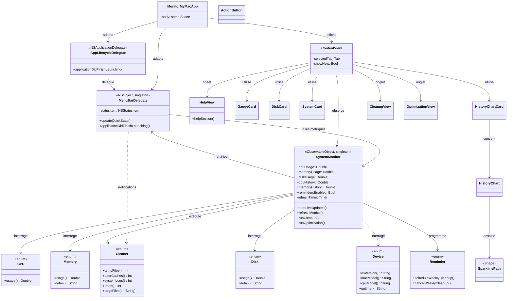
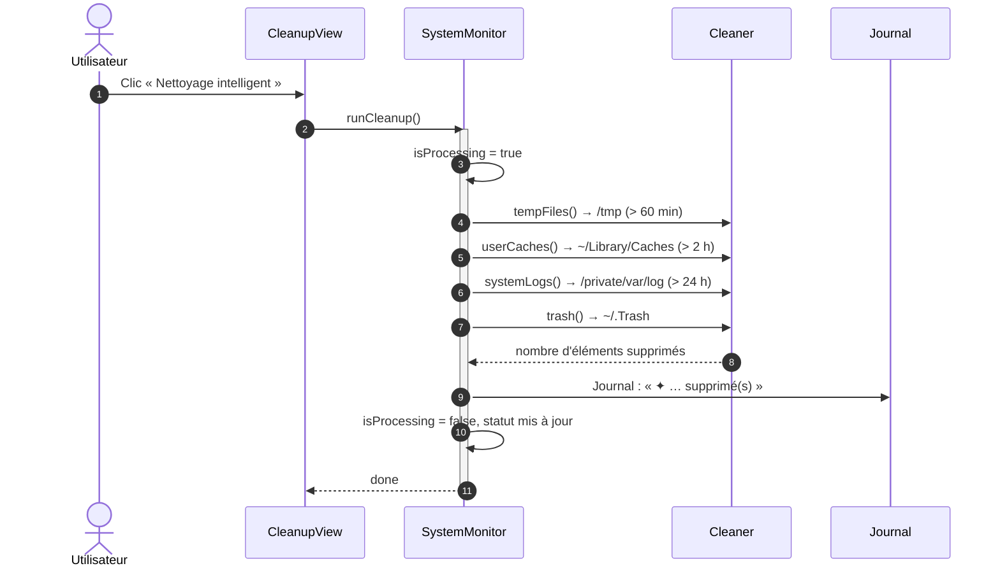
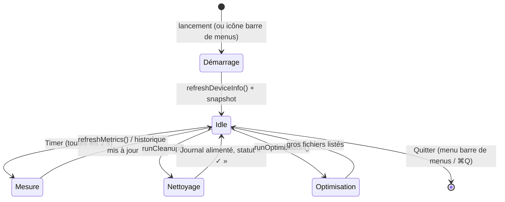
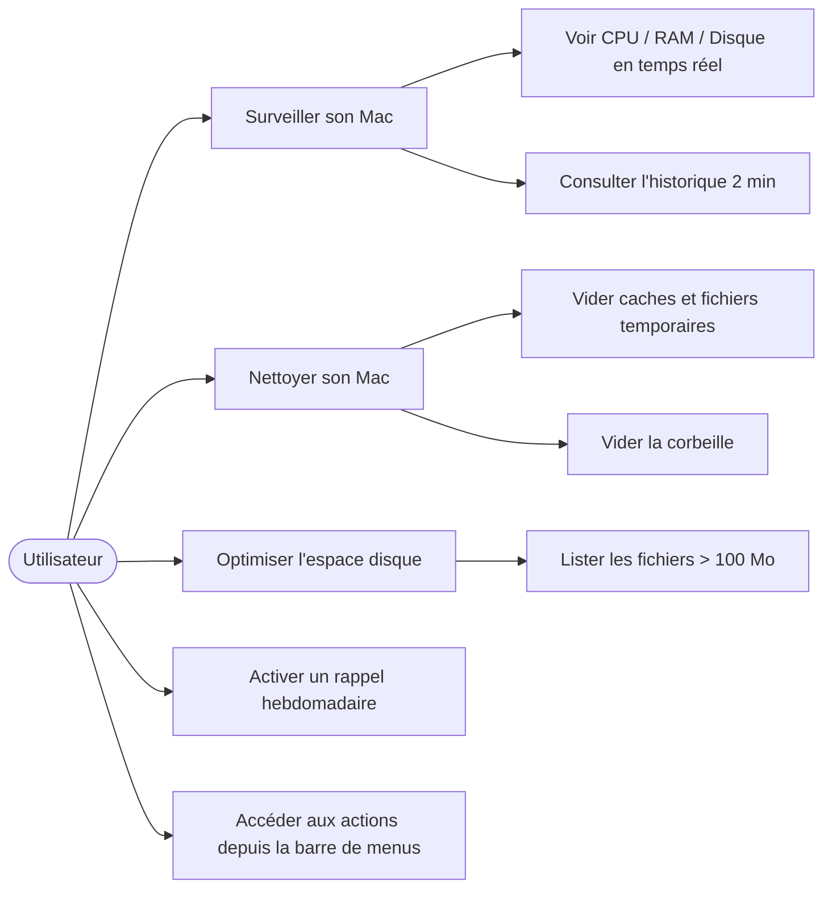

# Documentation Technique - MonitorMyMac

Documentation destinée aux développeurs souhaitant comprendre, modifier ou
étendre MonitorMyMac.

> **Auteur : Martial Zinsou**

---

## 1. Architecture

### 1.1 Vue d'ensemble

MonitorMyMac est une application **native macOS** écrite en **Swift + SwiftUI**.
Elle utilise exclusivement les utilitaires et frameworks système Apple
(`Process`, `FileManager`, `sysctl`, `vm_stat`, `df`, `system_profiler`...).
**Aucune dépendance tierce.**

```
┌────────────────────────────────────────────────────────────┐
│  MonitorMyMacApp  (@main, App + @NSApplicationDelegateAdaptor)
│  ├── AppLifecycleDelegate   → pont vers MenuBarDelegate.shared
│  ├── MenuBarDelegate        → NSStatusItem + menu + notifications
│  └── ContentView            (header / tabs / content / log)
│      ├── Surveillance → LazyVGrid de cartes (maison)       │
│      │     ├── GaugeCard   (anneau animé CPU/RAM)          │
│      │     ├── DiskCard    (barre de progression)          │
│      │     ├── SystemCard  (infos statiques)               │
│      │     └── HistoryChartCard (sparklines CPU/RAM)       │
│      ├── Nettoyage   → CleanupView (+ ActionButton)        │
│      └── Optimisation → OptimizationView (+ ActionButton)  │
│                                                              │
│  SystemMonitor (ObservableObject singleton)                 │
│  ├── Timer → refreshMetrics() toutes les 2 s                │
│  ├── cpuHistory/memoryHistory (60 points = 2 min)           │
│  ├── CPU.usage()      → top -l 1 -n 0 -s 0                 │
│  ├── Memory.usage()   → vm_stat + hw.memsize               │
│  ├── Disk.usage()     → df -h /                            │
│  ├── Device.*         → sysctl / system_profiler           │
│  ├── Cleaner.*        → find / rm / FileManager            │
│  └── Reminder.*       → UserNotifications (rappels)        │
└────────────────────────────────────────────────────────────┘
```

### 1.2 Flux d'exécution

1. `@main` démarre l'application ; `ContentView` apparaît.
2. `onAppear` appelle `monitor.startLiveUpdates()`.
3. Un `Timer` rafraîchit CPU / RAM / Disque toutes les 2 secondes.
4. L'utilisateur lance un nettoyage ou une optimisation via les onglets.
5. Les résultats sont ajoutés au **journal** et le statut est mis à jour.

### 1.3 Diagrammes UML

#### 1.3.1 Diagramme de classes



#### 1.3.2 Diagramme de séquence — Nettoyage intelligent



#### 1.3.3 Diagramme d'états — cycle de vie du rafraîchissement



#### 1.3.4 Diagramme de cas d'utilisation



---

## 2. Code source commenté

Fichier : `src/MonitorMyMacApp.swift`

### 2.1 Structure du fichier

| Élément | Rôle |
|---|---|
| `SystemMonitor` | Service observable **singleton** au cœur de l'interface |
| `MenuBarDelegate` | `NSStatusItem` + menu déroulant + délégué notifications |
| `AppLifecycleDelegate` | Pont entre le cycle de vie SwiftUI et la barre de menus |
| `Metric` | Modèle d'une statistique (ratio 0...1) |
| `CPU` | Calcule le taux CPU à partir de `top` |
| `Memory` | Calcule la RAM utilisée via `vm_stat` |
| `Disk` | Calcule l'espace disque via `df` |
| `Device` | Informations statiques (modèle, macOS, uptime) |
| `Cleaner` | Opérations de nettoyage / optimisation |
| `Reminder` | Rappels hebdomadaires via `UserNotifications` |
| `ContentView` | Interface principale et navigation par onglets |
| `GaugeCard` / `DiskCard` / `SystemCard` | Cartes de surveillance |
| `HistoryChartCard` / `HistoryChart` / `SparklinePath` | Graphiques d'historique |
| `ActionButton` / `CleanupView` / `OptimizationView` | Vues d'action |

### 2.2 Points techniques importants

- **CPU** : `top -l 1 -n 0 -s 0` puis parse de la ligne `CPU usage: … idle`.
  La valeur est bornée entre 0 et 1.
- **Mémoire** : `vm_stat` renvoie les pages libres/inactives ; la mémoire totale
  vient de `hw.memsize` (`ProcessInfo.physicalMemory`).
- **Disque** : `df -h /` ; le taux est extrait de la colonne *Capacity*.
- **Nettoyage** : `find` retourne la liste des fichiers, puis
  `FileManager.removeItem` les supprime individuellement (gère les refus de
  permission avec `try?`).
- **Gestion des erreurs** : toutes les commandes passent par des fonctions
  sécurisées qui renvoient `nil` ou `0` en cas d'échec — l'interface ne plante
  jamais.

---

## 3. Compilation

### 3.1 Depuis la ligne de commande (sans Xcode)

```bash
swiftc -parse-as-library src/MonitorMyMacApp.swift \
  -framework SwiftUI -framework AppKit -framework UserNotifications \
  -o MonitorMyMac.app/Contents/MacOS/MonitorMyMac
```

> L'option `-parse-as-library` est **obligatoire** pour que `@main` fonctionne
> (le fichier contient du code top-level de documentation, pas exécutable).

### 3.2 Signature ad hoc (pour exécution locale)

```bash
codesign --force --deep --sign - MonitorMyMac.app
```

### 3.3 Avec Xcode

Créez un projet *macOS → App* (SwiftUI), remplacez `ContentView.swift` par le
contenu de `MonitorMyMacApp.swift` et définissez le minimum :

- **Deployment Target** : macOS 13.0
- **Bundle Identifier** : `com.monitormymac.app`

---

## 4. Bundle macOS (.app)

### 4.1 Structure

```
MonitorMyMac.app/
└── Contents/
    ├── Info.plist           # Configuration du bundle
    └── MacOS/
        └── MonitorMyMac      # Binaire natif SwiftUI
```

### 4.2 `Info.plist`

| Clé | Valeur |
|---|---|
| `CFBundleExecutable` | `MonitorMyMac` |
| `CFBundleIdentifier` | `com.monitormymac.app` |
| `CFBundleName` | `MonitorMyMac` |
| `CFBundleShortVersionString` / `CFBundleVersion` | `2.0` / `2.0.0` |
| `LSMinimumSystemVersion` | `10.15` |
| `LSApplicationCategoryType` | `public.app-category.utilities` |
| `NSHighResolutionCapable` | `true` |

---

## 5. Étendre MonitorMyMac

### Ajouter une métrique (ex : batterie)

```swift
enum Battery {
    static func level() -> Double {
        // system_profiler SPPowerDataType → "State of Charge"
        ...
    }
}
```

Puis affichez-la dans `monitoringGrid` à l'aide d'une `GaugeCard` :

```swift
GaugeCard(title: "Batterie", subtitle: monitor.modelInfo, icon: "battery.100",
          color: .green, ratio: Battery.level(), footer: "Niveau estimé")
```

### Ajouter une action de nettoyage

```swift
static func oldDownloads() -> Int {
    delete(in: FileManager.default.homeDirectoryForCurrentUser
                .appendingPathComponent("Downloads").path,
           patterns: ["*"], olderThanMinutes: 43_200) // 30 jours
}
```

Puis intégrez-la dans `SystemMonitor.runCleanup()`.

---

## 6. Tests

### 6.1 Test manuel

```bash
open MonitorMyMac.app
```

Vérifications :
- Les jauges CPU / RAM / Disque bougent pendant l'activité.
- Le bouton « Nettoyage intelligent » remplit le journal.
- Le journal est vidé par « Effacer ».

### 6.2 Outil CLI (bonus)

`src/monitormymac.sh` est un outil en ligne de commande autonome :

```bash
bash -n src/monitormymac.sh      # valide la syntaxe
./src/monitormymac.sh            # exécution directe
```

---

## 7. Captures d'écran

> Les captures ont été réalisées sur macOS avec l'application en fonctionnement réel.

| Capture | Fichier |
|---|---|
| Onglet **Surveillance** (jauges, cartes, historique) |  |
| Onglet **Nettoyage** (rapels et bouton de nettoyage) |  |
| Onglet **Optimisation** (analyse d'espace) |  |
| Icône **barre de menus** (CPU en direct) |  |
| Fenêtre **Aide** illustrée |  |

## 8. Historique des versions

| Version | Date | Changements |
|---|---|---|
| 1.0.0 | 2025 | Outil CLI bash + bundle .app |
| 2.0.0 | 2025 | Réécriture **SwiftUI** : interface élégante, jauges animées, statistiques en temps réel |
| 2.1.0 | 2025 | **Barre de menus**, **graphiques d'historique** (CPU/RAM), **rappels hebdomadaires** |

---

*Auteur : **Martial Zinsou***