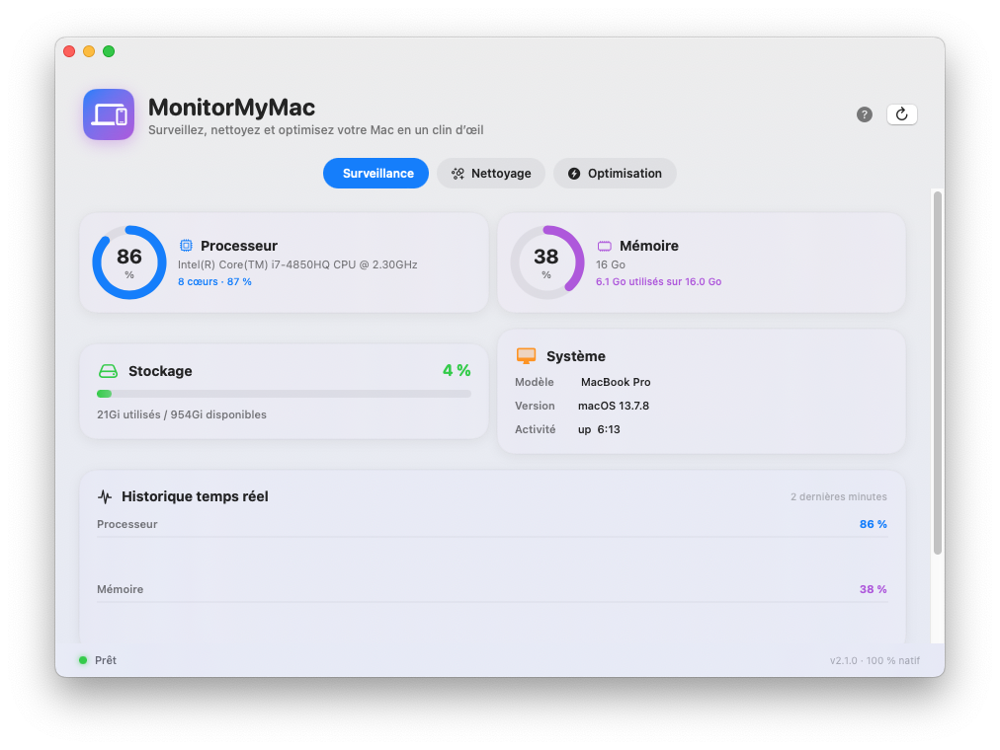
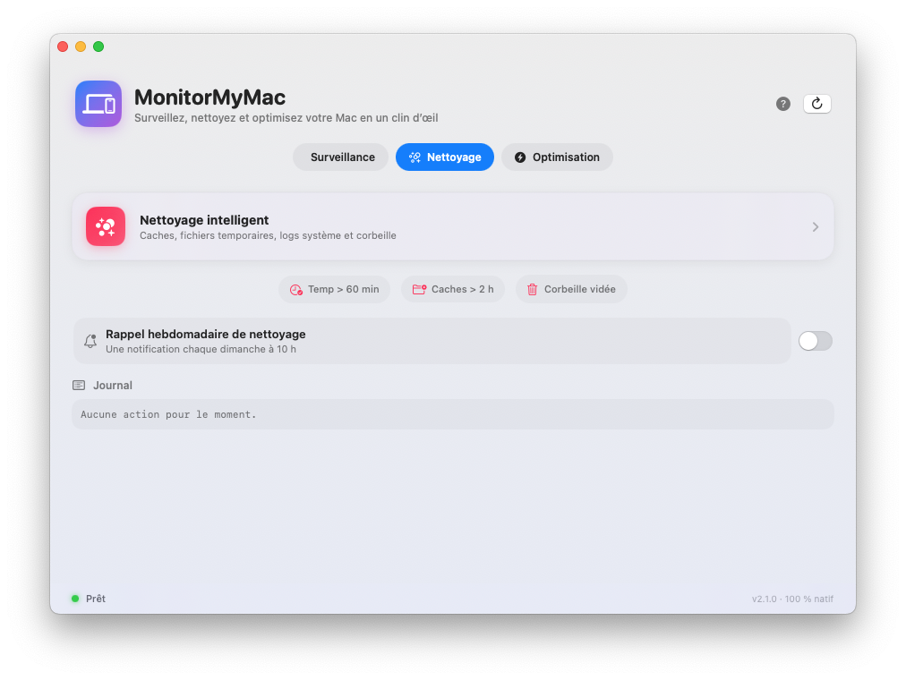
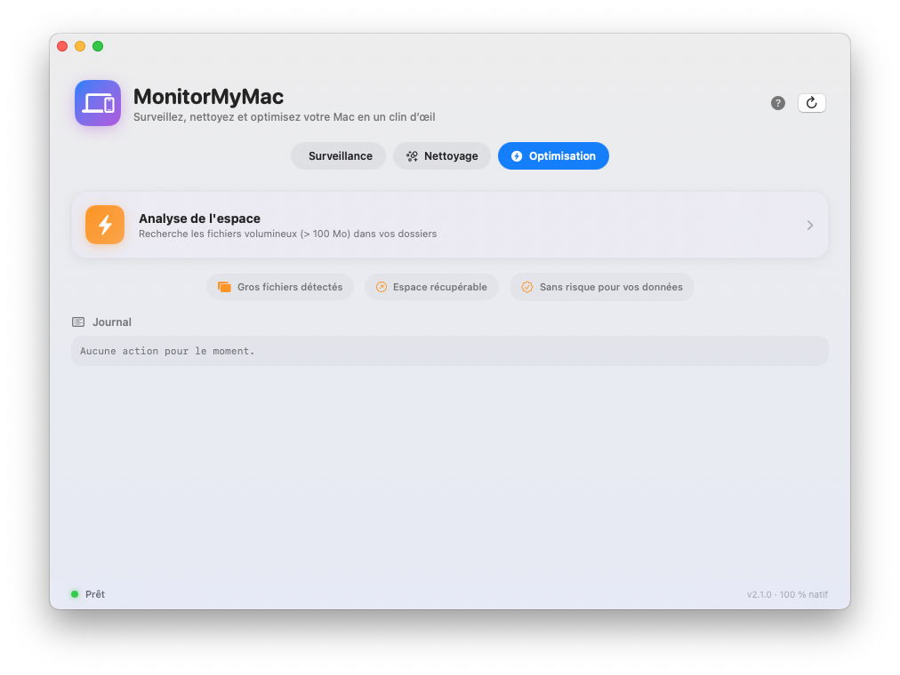
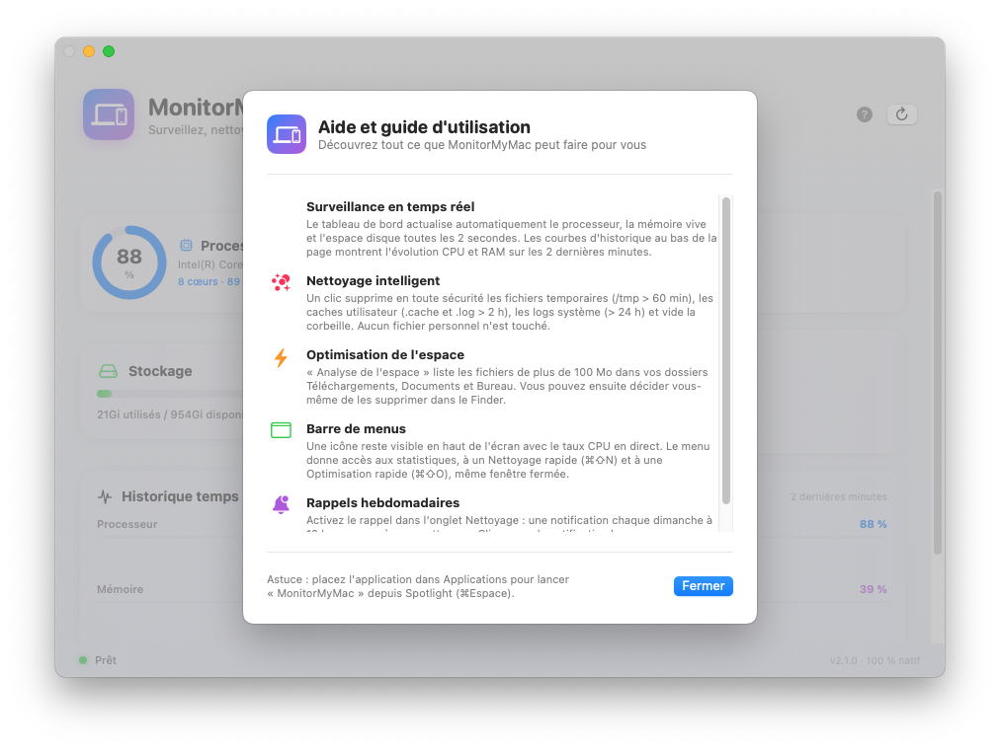

# Guide Utilisateur - MonitorMyMac

Bienvenue dans **MonitorMyMac**, votre assistant personnel pour surveiller,
nettoyer et optimiser votre Mac — simplement et avec une interface élégante.

> 🖥️ **Ce guide est illustré** : chaque étape est accompagnée de captures
> d'écran réelles de l'application.

---

## 1. Premiers pas

### 1.1 Installation

1. Téléchargez le dossier `MonitorMyMac`.
2. Placez-le dans votre dossier `Applications` (ou n'importe où sur votre disque).
3. Double-cliquez sur `MonitorMyMac.app` pour lancer l'application.

> **Astuce** : Si macOS bloque l'ouverture, faites un clic droit sur l'application
> puis choisissez **Ouvrir** pour autoriser l'exécution.

### 1.2 Premier lancement

À l'ouverture, l'application affiche immédiatement l'onglet **Surveillance** :
les statistiques de votre Mac se mettent automatiquement à jour **toutes les 2 secondes**.

---

## 2. L'interface

L'application s'ouvre sur une fenêtre moderne et minimaliste composée de :

| Zone | Rôle |
|---|---|
| **En-tête** | Logo, titre, indicateur d'activité, bouton **?** (aider) et bouton d'actualisation |
| **Onglets** | `Surveillance` · `Nettoyage` · `Optimisation` |
| **Cartes** | Jauges animées et statistiques en direct |
| **Historique** | Courbes d'évolution CPU & RAM (2 dernières minutes) |
| **Barre de menus** | Icône macOS + % CPU, menu et actions rapides |
| **Journal** | Suivi de toutes les actions effectuées |
| **Pied de page** | Statut en direct de l'application |

---

## 3. Onglet Surveillance 📊



Les cartes se **mettent à jour automatiquement toutes les 2 secondes** :

- **Processeur** 🖥️ : jauge annulaire du taux d'utilisation + modèle et nombre de cœurs.
- **Mémoire** 🧠 : jauge annulaire + mémoire utilisée / totale.
- **Stockage** 💾 : barre de progression de l'espace disque.
- **Système** 🖱️ : modèle du Mac, version macOS, durée d'activité.
- **Historique temps réel** 📈 : deux courbes de tendance situées sous les cartes
  (en **bleu** = CPU, en **violet** = RAM).

> 💡 Utilisez le bouton **↻** (en haut à droite) pour rafraîchir immédiatement.

---

## 4. Onglet Nettoyage 🧹



Cliquez sur **« Nettoyage intelligent »** pour supprimer en toute sécurité :

- les **fichiers temporaires** de `/tmp` (> 60 minutes) ;
- les **caches utilisateur** (`.cache`, `.log` > 2 heures) ;
- les **logs système** (> 24 h, si les permissions le permettent) ;
- la **corbeille**.

Trois pastilles sous le bouton rappellent la portée du nettoyage :
`Temp > 60 min` · `Caches > 2 h` · `Corbeille vidée`.

### 🔔 Activez le rappel hebdomadaire

En bas de l'onglet, l'interrupteur **« Rappel hebdomadaire de nettoyage »**
programme une notification chaque **dimanche à 10 h**.
Cliquez sur la notification pour lancer un nettoyage immédiat.

---

## 5. Onglet Optimisation ⚡



Cliquez sur **« Analyse de l'espace »** pour lister les **fichiers volumineux
(> 100 Mo)** présents dans vos dossiers Téléchargements, Documents et Bureau.
Vous pourrez ensuite les supprimer manuellement dans le Finder.

> ✅ L'optimisation **ne supprime rien** : elle se contente de **signaler**
> les gros fichiers. Le choix final vous appartient toujours.

---

## 6. La barre de menus 🍎


L'icône **MonitorMyMac** avec son **taux CPU en direct** reste visible en haut
de l'écran. Un clic ouvre le menu déroulant :

| Élément du menu | Action |
|---|---|
| **MonitorMyMac** | Rappelle la fenêtre principale |
| **Statut** | État courant (« Prêt », « Nettoyage terminé ✓ »…) |
| **CPU / RAM / Disque** | Pourcentages en un coup d'œil |
| **🧹 Nettoyage rapide** (`⌘⇧N`) | Lance le nettoyage sans ouvrir la fenêtre |
| **⚡ Optimisation rapide** (`⌘⇧O`) | Lance l'analyse d'espace |
| **Quitter** | Ferme complètement l'application |

> L'application reste active dans la barre de menus **même quand on ferme la
> fenêtre**. Utilisez **Quitter** via le menu pour l'arrêter totalement.

---

## 7. La fenêtre Aide ❓



Cliquez sur le bouton **?** dans l'en-tête pour ouvrir l'aide intégrée qui
décrit **chaque fonctionnalité** de l'application avec des illustrations :
surveillance, nettoyage, optimisation, barre de menus et rappels.

---

## 8. Lire le journal 📜

Chaque action est consignée dans le panneau **Journal** en bas de la fenêtre :

```
═══════════ NETTOYAGE ═══════════
  ✦ Fichiers temporaires (/tmp) : 12 élément(s) supprimé(s)
  ✦ Caches utilisateur : 34 élément(s) supprimé(s)
```

- **Vider le journal** : cliquez sur *Effacer*.
- **Statut** : le pied de page affiche « Nettoyage terminé ✓ » une fois l'action finie.

---

## 9. Foire aux questions

### Combien de temps dure un nettoyage ?
Quelques secondes seulement.

### Est-ce que MonitorMyMac peut endommager mon Mac ?
**Non.** Il ne supprime que des fichiers temporaires et des caches, comme le
recommande Apple. Il ne touche jamais à vos documents, photos ou applications.

### Les statistiques sont-elles en direct ?
Oui, les cartes CPU, Mémoire et Stockage se rafraîchissent toutes les 2 secondes,
et l'historique affiche leur évolution sur 2 minutes.

### Que se passe-t-il si j'active les rappels ?
macOS demandera l'autorisation d'envoyer des notifications. Ensuite, un rappel
sera programmé chaque **dimanche à 10 h**. Cliquer sur la notification lance le
nettoyage automatiquement.

### Mon Mac s'arrête-t-il quand je ferme la fenêtre ?
Non. L'application reste dans la **barre de menus** pour un accès rapide.
Utilisez *Quitter* dans le menu pour fermer complètement l'application.

### Mes fichiers personnels seront-ils supprimés ?
Non. La corbeille n'est vidée que si elle contient vos propres fichiers, et
aucun répertoire personnel n'est modifié.

### Puis-je utiliser MonitorMyMac avec des droits admin ?
Le nettoyage des logs système (`/private/var/log`) peut nécessiter des droits
élevés. Sur certains systèmes, cliquez sur l'application avec **clic droit →
Ouvrir** une fois pour lui accorder les permissions demandées.

### Est-ce compatible avec Apple Silicon (M1/M2/M3) ?
Oui. L'application est 100 % native et universelle (Intel & Apple Silicon).

---

## 10. Dépannage

| Problème | Solution |
|---|---|
| L'application ne s'ouvre pas | Clic droit → **Ouvrir**, puis confirmer |
| Les jauges restent à 0 % | Relancez l'application (mise à jour automatique) |
| La fenêtre ne réapparaît pas | Clic sur **MonitorMyMac** dans la barre de menus |
| Nettoyage partiel | Exécutez le script CLI en `sudo` (voir doc technique) |

Besoin d'aide ? Consultez la [documentation technique](DOCUMENTATION.md).