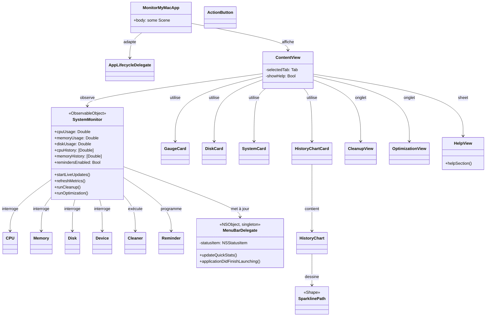
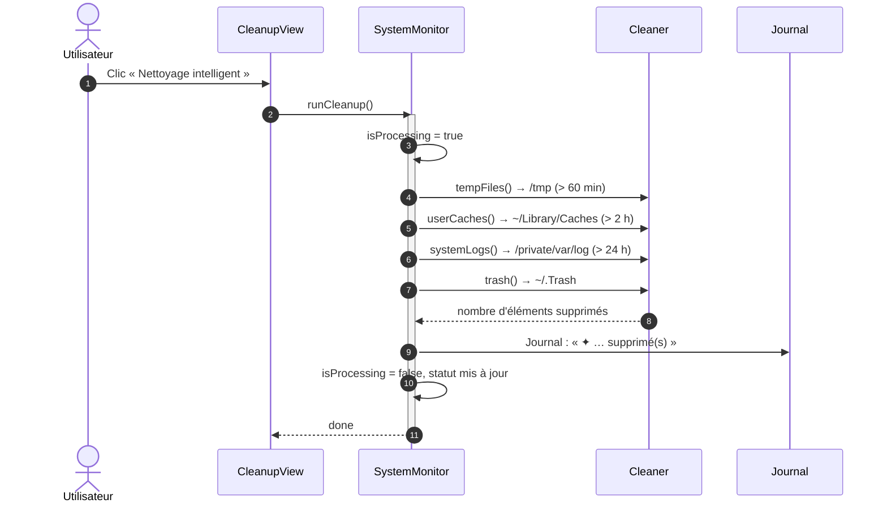
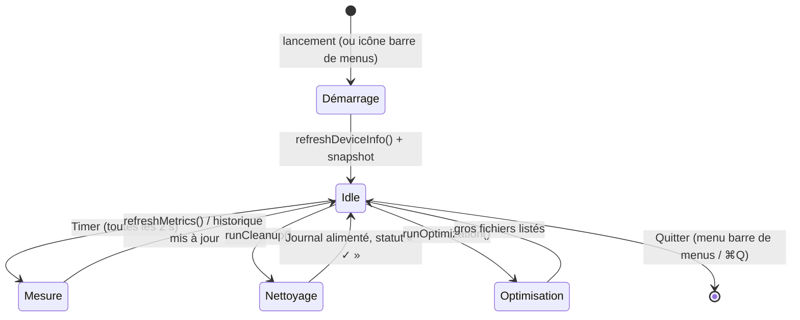
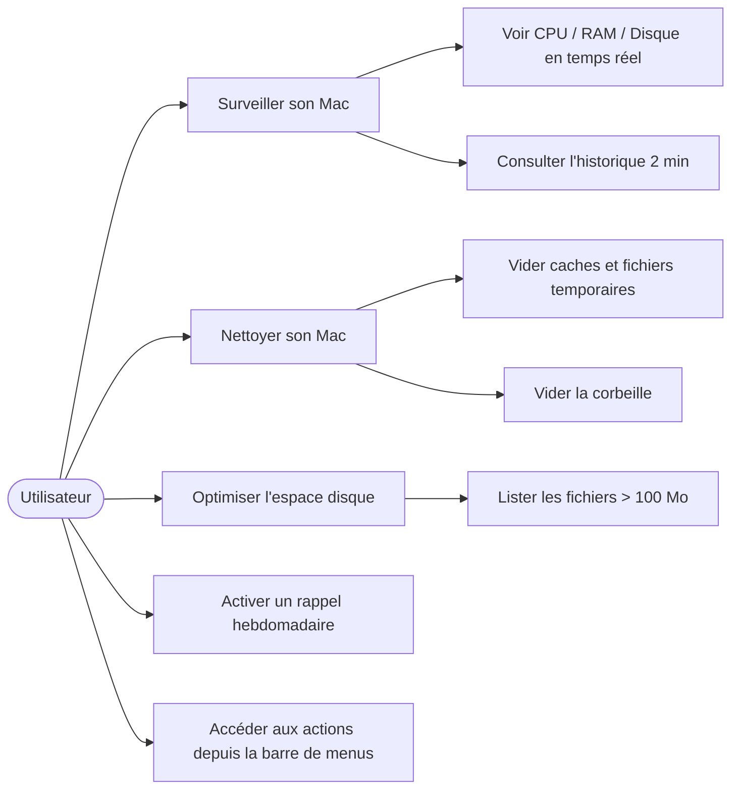

# MonitorMyMac — Wiki du projet

## Vue d'ensemble

**MonitorMyMac** est une application **native macOS** élégante et conviviale qui vous permet de **surveiller**, **nettoyer** et **optimiser** votre Mac en un clin d'œil — directement depuis sa **barre de menus**.

- **Version actuelle** : v2.1.0
- **Auteur** : Martial Zinsou
- **Licence** : MIT
- **Technologies** : SwiftUI, Swift, CommandLineTools (pas d'Xcode complet)
- **Compatibilité** : macOS 10.15+, Intel & Apple Silicon (M1/M2/M3)

## Captures d'écran

| # | Capture | Description |
|---|---|---|
| 1 |  | Onglet **Surveillance** : jauges CPU/RAM animées, cartes système, historique temps réel (2 courbes : bleu = CPU, violet = RAM). |
| 2 |  | Onglet **Nettoyage** : bouton « Nettoyage intelligent », pastilles de portée (Temp > 60 min, Caches > 2 h, Corbeille), interrupteur rappel hebdomadaire (dimanche 10 h). |
| 3 |  | Onglet **Optimisation** : bouton « Analyse de l'espace », liste des fichiers > 100 Mo dans Téléchargements/Documents/Bureau. |
| 4 |  | Icône **barre de menus** : affichage CPU en direct (ex. « 23 % »), menu déroulant avec actions rapides (⌘⇧N Nettoyage, ⌘⇧O Optimisation, Quitter). |
| 5 |  | Fenêtre **Aide** illustrée (bouton `?` dans l'en-tête) : descriptions détaillées de chaque fonctionnalité avec symboles SF Symbols. |

> **Astuce** : pour ajouter de nouvelles captures, lancer l'application, accéder à l'écran souhaité, puis utiliser `screencapture -l <ID_FENÊTRE> wiki/screenshots/06-nouvelle.png`.

---

## Diagrammes UML

### 1. Diagramme de classes



### 2. Diagramme de séquence — Nettoyage intelligent



### 3. Diagramme d'états — cycle de vie du rafraîchissement



### 4. Diagramme de cas d'utilisation



---

## Getting Started

### Installation

1. Téléchargez le dossier `MonitorMyMac`.
2. Placez-le dans votre dossier `Applications` (ou n'importe où sur votre disque).
3. Double-cliquez sur `MonitorMyMac.app` pour lancer l'application.

> **Astuce** : Si macOS bloque l'ouverture, faites un clic droit sur l'application puis choisissez **Ouvrir** pour autoriser l'exécution.

### Lancement et utilisation

À l'ouverture, l'application affiche immédiatement l'onglet **Surveillance** : les statistiques de votre Mac se mettent automatiquement à jour **toutes les 2 secondes**.

- Cliquez sur les onglets **Surveillance**, **Nettoyage**, **Optimisation** pour accéder aux fonctionnalités.
- Utilisez le bouton **?** dans l'en-tête pour ouvrir l'aide intégrée.
- L'icône **MonitorMyMac** reste visible dans la barre de menus en haut de l'écran.
- Raccourcis clavier : `⌘⇧N` (Nettoyage rapide), `⌘⇧O` (Optimisation rapide).

### Commandes CLI (optionnelles)

L'application bundle inclus un script bash `monitormymac.sh` utilisable en ligne de commande :

```bash
# Exemple : lancer directement l'onglet Nettoyage
./monitormymac.sh --tab=nettoyage

# Afficher l'aide
./monitormymac.sh --help
```

### Règles de développement

- L'application est construite avec `swiftc` (CommandLineTools Swift 5.8.1), sans Xcode complet.
- Pas d'accessibilité AppleScript (`osascript`) disponible — les captures d'écran se font via le helper `windowid` (CGWindowListCopyWindowInfo) + `screencapture -l <ID>`.
- Les métriques CPU/Mémoire/Disk sont récupérées via `/usr/sbin/system_profiler`, `/bin/df`, et des chemins système internes.
- Le minuteur de rafraîchissement interne est de **2 secondes**.
- Les historiques CPU/RAM conservent **60 points** (soit 2 minutes à 2 s par point). Une extension vers 1800 points (1 h) est prévue dans `metricRecords`.

---

## Auteur

**Martial Zinsou** — Développeur et auteur de MonitorMyMac.

- Repo GitHub : <https://github.com/martialzinsou/MonitorMyMac>
- Ce wiki est généré à partir des fichiers `docs/` et `wiki/` du dépôt.
- Toute modification ou contribution : ouvrir une issue ou forker le dépôt.

---