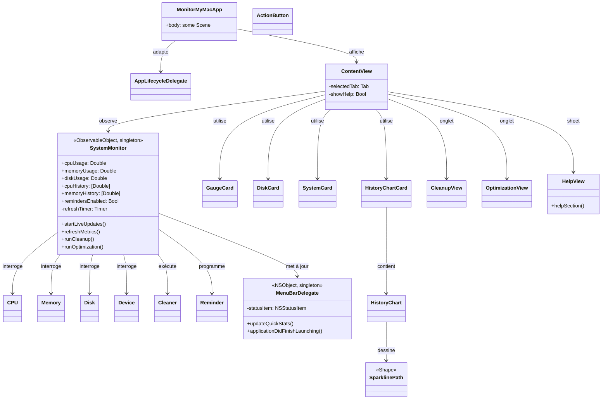
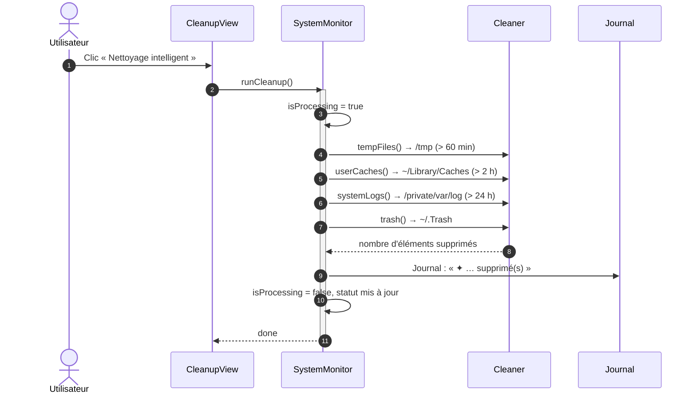
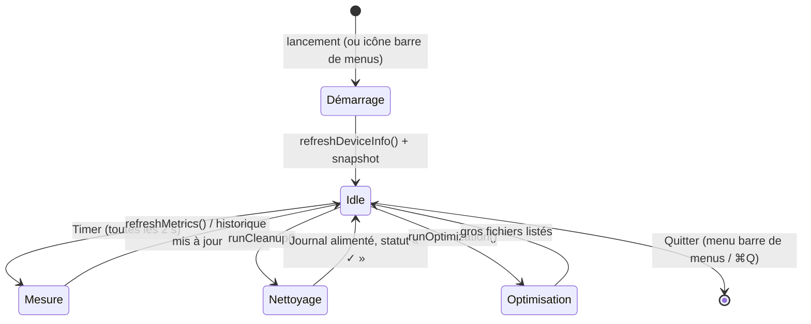
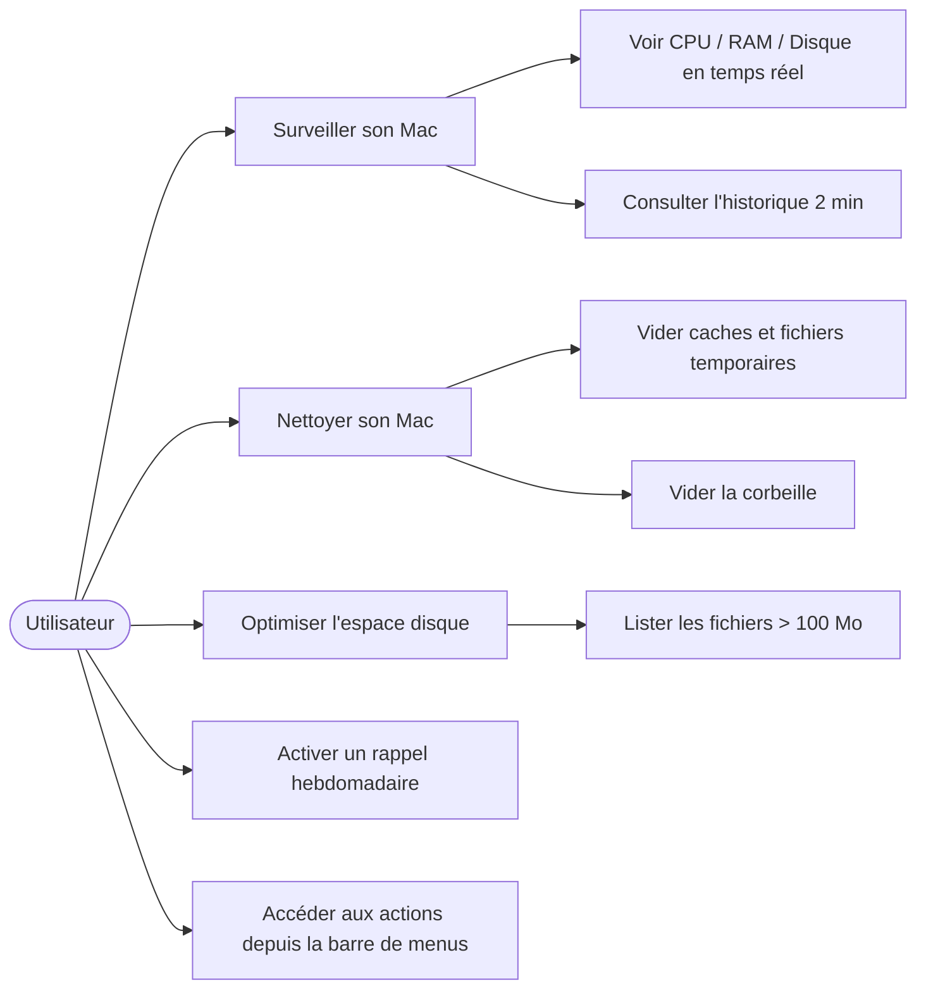

# MonitorMyMac — Diagrammes UML

Cette section présente l'ensemble des diagrammes UML (Modélisation Unifiée du Langage) utilisés pour décrire l'architecture, le flux d'exécution et les cas d'utilisation de MonitorMyMac. Tous les diagrammes sont rédigés en **syntaxe Mermaid** et peuvent être visualisés directement sur GitHub (pages wiki ou fichiers `.md` du dépôt).

---

## 1. Diagramme de classes

Représente les principales classes et structures du projet, leurs responsabilités et leurs relations d'association, d'héritage et de dépendance.



---

## 2. Diagramme de séquence — Flux de nettoyage intelligent

Montre l'interaction pas à pas entre l'utilisateur, la vue de nettoyage, le moniteur système et le nettoyeur lorsqu'un nettoyage est déclenché.



---

## 3. Diagramme d'états — Cycle de vie du rafraîchissement

Montre les différents états que traverse l'application, depuis le lancement jusqu'à la sortie, en passant par le rafraîchissement périodique et les actions utilisateur.



---

## 4. Diagramme de cas d'utilisation

Montre les actions principales que l'utilisateur peut effectuer dans l'application, depuis l'interface utilisateur jusqu'aux fonctionnalités sous-jacentes.



---

## 5. Schéma d'architecture globale (vue d'ensemble)

```mermaid
graph TD
    subgraph "Interface Utilisateur"
        C[ContentView] -->|écoute| S[SystemMonitor]
        C -->|utilise| GC[GaugeCard]
        C -->|utilise| DC[DiskCard]
        C -->|utilise| SC[SystemCard]
        C -->|utilise| HCC[HistoryChartCard]
        C -->|onglet| CV[CleanupView]
        C -->|onglet| OV[OptimizationView]
        C -->|sheet| HV[HelpView]
    end

    subgraph "Services & Logique"
        SM[SystemMonitor] -->|interroge| CPU[CPU]
        SM -->|interroge| MEM[Memory]
        SM -->|interroge| DISK[Disk]
        SM -->|interroge| DEV[Device]
        SM -->|exécute| CLN[Cleaner]
        SM -->|programme| RM[Reminder]
        SM -->|met à jour| MBD[MenuBarDelegate]
    end

    subgraph "Barre de menus"
        MBD -->|icône+sparkline| NB[NSStatusItem]
        MBD -->|menu| MM[NSMenu]
    end

    style MonitorMyMacApp fill:#f9f9f9,stroke:#333,stroke-width:2px